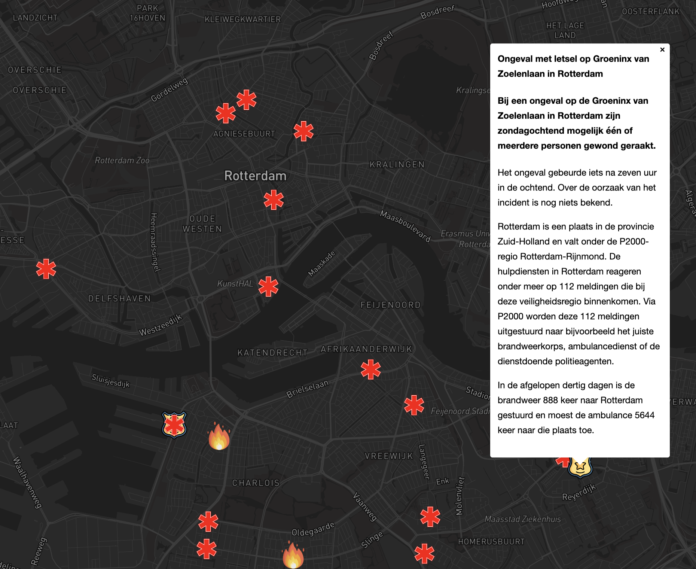

# 112 Live - Netherlands

This project scrapes data from <https://alarmeringen.nl> and shows the latest 112 reports on a map using Mapbox.

**WARNING**: Do not use this project on a scale that puts a lot of load on the scraping target. This project is intended as a proof of concept, not as a tool to be used at scale.

**WARNING**: This project is not affiliated with <https://alarmeringen.nl> in any way.

## Installation

1. Clone this repository
2. Log in to [Mapbox website](https://www.mapbox.com/) and create a new access token.
3. Copy the contents of `.env.example` to `.env` and fill in the values. The `MAPBOX_ACCESS_TOKEN` is the token you created in step 2.
4. Run `npm install` to install the dependencies
5. Run `npm run dev` to start the development server
6. Open [http://localhost:3000](http://localhost:3000) in your browser

## Troubleshooting

### The requests to `alarmeringen.nl` are failing

You might need to update the cookie in `alarmeringen-proxy.ts` file. To do so, go to the [alarmeringen.nl](https://alarmeringen.nl) website, open the developer tools, go to the network tab and refresh the page. Find the request to `alarmeringen.nl` and copy the value of the `Cookie` header. Paste it in the `alarmeringen-proxy.ts` file.
